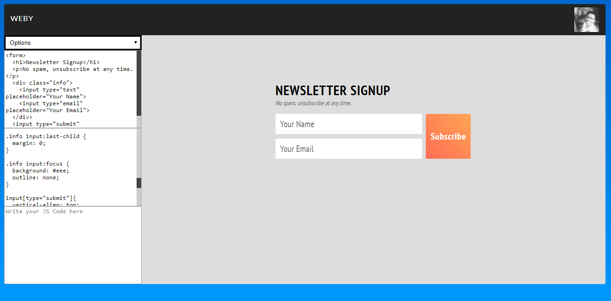

# WebY
Learn Web, Simulate your web-code and manage your projects [Any externals libs require, only Javascript]
-------------------------------------------------------------------------------------------------------------------
Am still working on in to integrate Exercise and examples 

NB: Just *open index.html* , it's simple as it! Let me know, if there are some trouble
