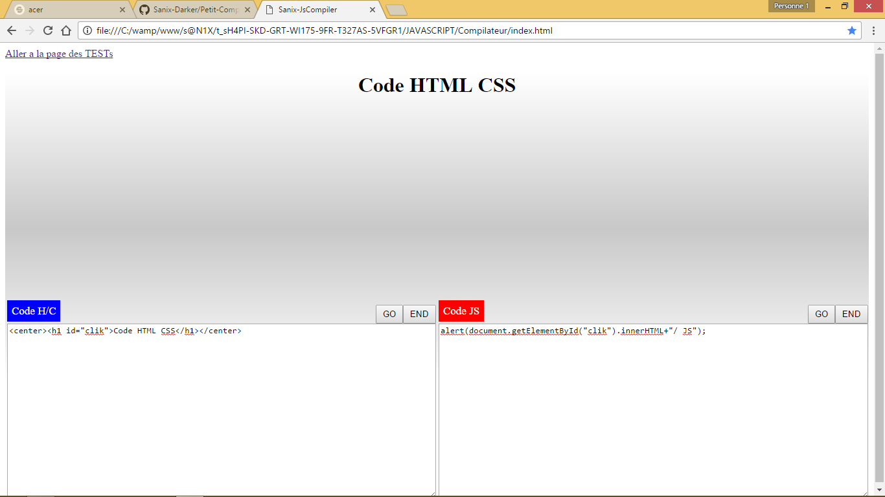
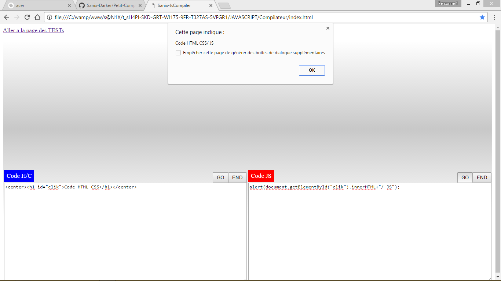

# Petit-Compilateur-HTML-CSS-JS
Il s'agit juste d'une petite app HTML et JS qui interprete en temps reel le code que l'on ecrit
-------------------------------------------------------------------------------------------------------------------
NB: Ne vous attarder pas sur les fichiers en racines, le compilateur est dans le dossier compilateur que vous voyez juste en haut
<table style="width:100%;">
  <tr>
    <td></td>
    <td></td>
  </tr>
</table>
